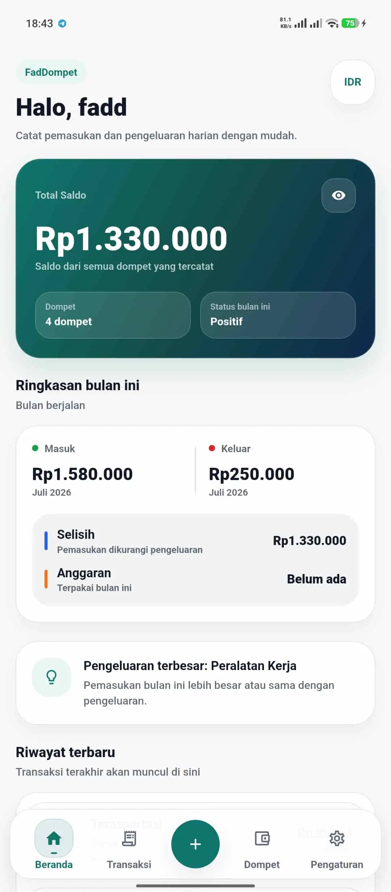
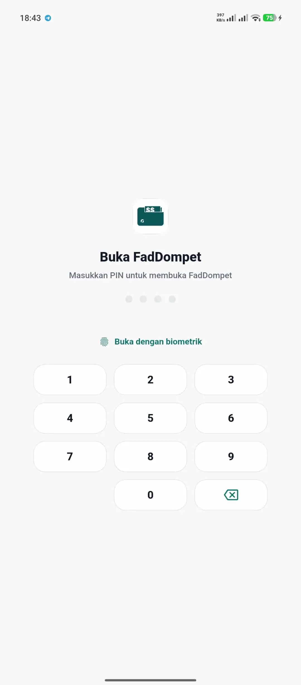
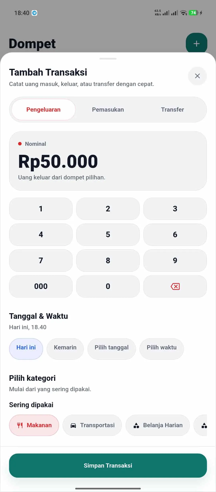
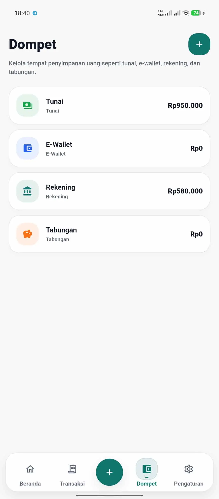
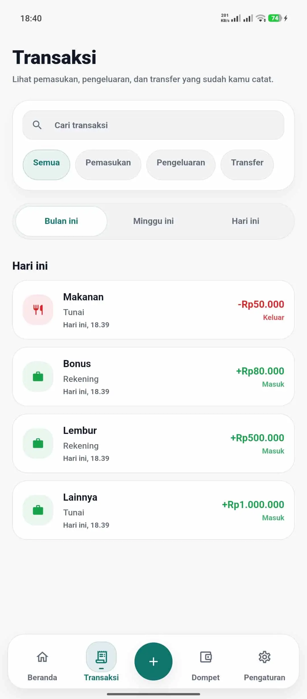
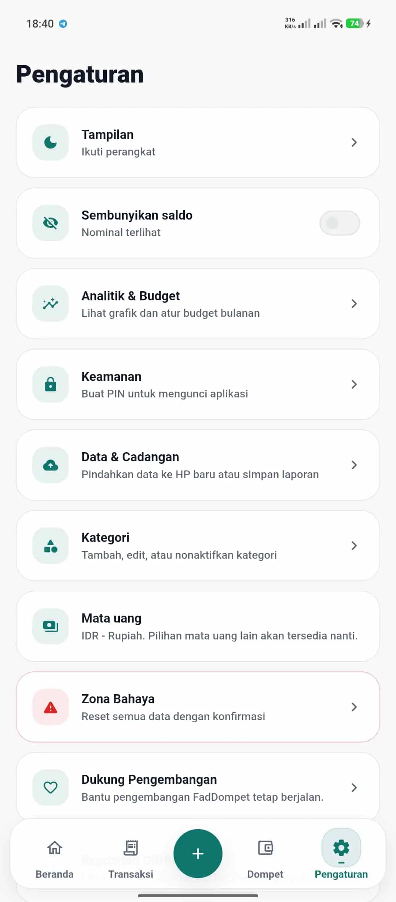
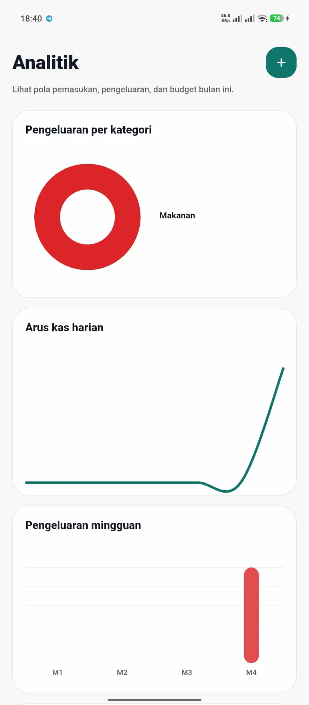

<p align="center">
  
</p>

<h1 align="center">Uangku</h1>

<p align="center">
  Offline-first personal finance tracker for Android.
</p>

<p align="center">
  Uangku helps users track income, expenses, wallets, budgets, and backups locally on their device.
</p>

<p align="center">
  
  
  <a href="LICENSE"></a>
  
</p>

## Screenshots

<p align="center">
  
  
  
  
</p>

<p align="center">
  
  
  
</p>

## Features

- Income and expense tracking
- Wallet management
- Transfer between wallets
- Monthly budgets
- Analytics and summaries
- Receipt/screenshot scanning with on-device OCR (auto-fills amount, date, and note)
- Local app lock with PIN and optional biometric unlock
- Backup and restore for moving data between phones
- CSV transaction export
- Offline-first local storage

## Privacy Model

- No account
- No cloud sync
- No ads
- No analytics or tracking
- Data stays on the device
- Receipt scanning runs fully on-device via Google ML Kit — no images are sent to any server
- Backup files contain financial data and should be stored safely

## Download / Build From Source

This project doesn't have a published release yet. To build your own APK:

Requirements:

- Flutter stable
- Android SDK
- Java 17

Commands:

```bash
flutter pub get
flutter analyze
flutter test
flutter build apk --release --split-per-abi
```

Release signing uses a local keystore. Do not commit `android/key.properties`, `.jks`, or `.keystore` files.

## Tech Stack

- Flutter
- Dart
- Drift
- SQLite
- Riverpod
- fl_chart
- Google ML Kit (on-device text recognition)
- Android

## Project Structure

```txt
lib/app       App bootstrap, theme, and providers
lib/core      Constants, enums, formatters, and helpers
lib/data      Drift database, repositories, backup, security, receipt scanning
lib/features  Feature-first UI modules
lib/shared    Shared layouts, widgets, and components
test          Unit and widget tests
android       Android host project
```

## Roadmap

- UI polish
- Backup encryption
- Better data export
- Optional database encryption
- More tests

## Credits

Uangku is built on top of [FadDompet](https://github.com/fadd3079-prog/faddompet) by Mufaddhol, an open-source offline-first finance tracker released under the MIT License.

## License

Uangku is released under the [MIT License](LICENSE), same as the original FadDompet project it's built from.
